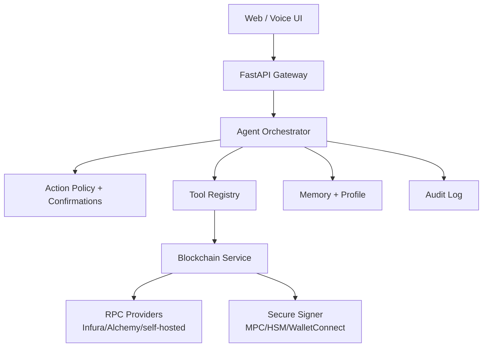

# Veronica Blockchain Agent Integration Blueprint

## Objective
Transform Veronica from a conversational assistant into an **AI agent that can reason about and safely orchestrate blockchain operations**.

## Professional Architecture (recommended)

## What is implemented now (first build step)
- Added blockchain service primitives (`app.blockchain.service`) for:
  - `eth_getBalance` read calls via JSON-RPC.
  - safe transfer simulation flow (`simulate_transfer`) instead of direct transaction send.
- Added LangChain tools:
  - `get_wallet_balance(address)`
  - `prepare_crypto_transfer(to_address, amount_eth)`
- Added policy guard detection for transfer intents (`transfer X ETH to 0x...`) with explicit confirmation before execution.

## Next implementation phases

### Phase 1: Secure transaction pipeline
1. Add `TransactionIntent` model with chain, token, recipient, value, nonce policy.
2. Integrate signer abstraction:
   - local dev signer (test wallet)
   - production signer (MPC/KMS/HSM or WalletConnect)
3. Implement dry-run + gas estimation + risk scoring.
4. Persist signed intent and audit evidence.

### Phase 2: Multi-chain and DeFi actions
1. Add chain adapters (`Ethereum`, `Polygon`, `Arbitrum`, `Base`).
2. Add token transfer and balance tools (ERC-20 ABI calls).
3. Add on-chain data tools:
   - transaction lookup
   - token allowance checks
   - contract verification status

### Phase 3: Agent-native autonomy
1. Goal planner that can propose transaction plans with rationale.
2. Policy engine with user-specific limits:
   - per-day transfer limit
   - trusted address book
   - mandatory second-factor for high-value actions
3. Continuous monitoring jobs for wallet alerts, protocol events, and risk notifications.

## Security baseline (mandatory)
- Never store private keys in plaintext.
- Require explicit confirmation for every state-changing action.
- Add anti-phishing controls (ENS/address labeling + checksum checks).
- Add compliance hooks (KYT/AML provider integration where required).

## Example user interaction
1. User: "Transfer 0.15 ETH to 0xabc..."
2. Veronica: "I detected a blockchain transfer. Please confirm action ID ..."
3. User: "confirm ..."
4. Veronica executes signer flow (currently simulated), then reports tx hash/audit ID.

## Environment variables to add
- `BLOCKCHAIN_ENABLED=true`
- `BLOCKCHAIN_NETWORK=ethereum`
- `BLOCKCHAIN_RPC_URL=https://...`
- `BLOCKCHAIN_DEFAULT_WALLET=0x...`

## KPI suggestions
- Confirmed-action success rate.
- False positive/negative action detection rate.
- Mean execution latency (intent -> tx hash).
- Policy intervention rate (blocked/high-risk actions).
